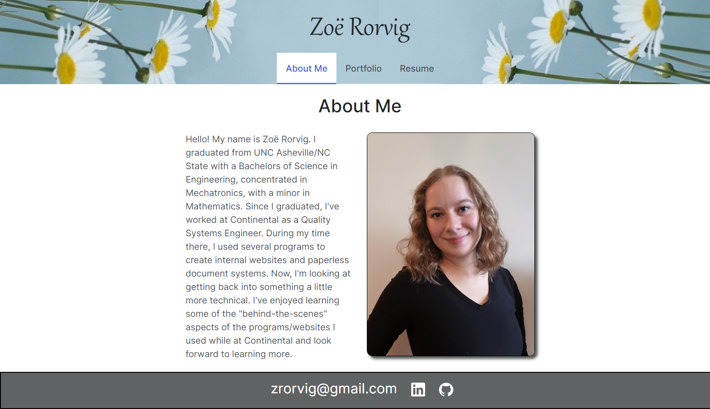

# My React Profile
[Deployed Application](https://zoerorvig.github.io/my-react-portfolio/)

## Table of Contents
- [Description](#description)
- [Visuals](#visuals)

## Description 
This portfolio was created with REACT to display completed projects, about me information, and contact information.  

Features Include:
- Navigation tabs that move the site through different pages and stay highlighted on the current page. 
- About Me section featuring information about the creator and profile pictures. 
- Portfolio section featuring six sample projects, including a link to the deployed application and the GiHub repository. 
- Resume section featuring a screenshot of the resume that is linked to a downloadable copy. This section also includes a list of proficiencies. 
- Footer section featuring linked icons to linkedIn, GitHub, and Instagram profiles. 

## Visuals 

The following is a screenshot of the About Me page:

The following is a screenshot of the Portfolio page:

The following is a screenshot of the Resume page:

